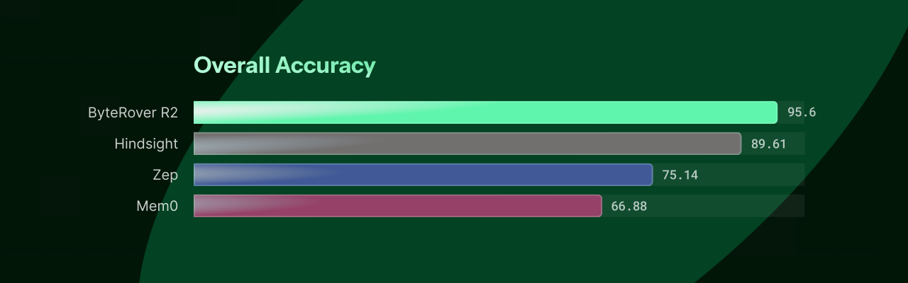
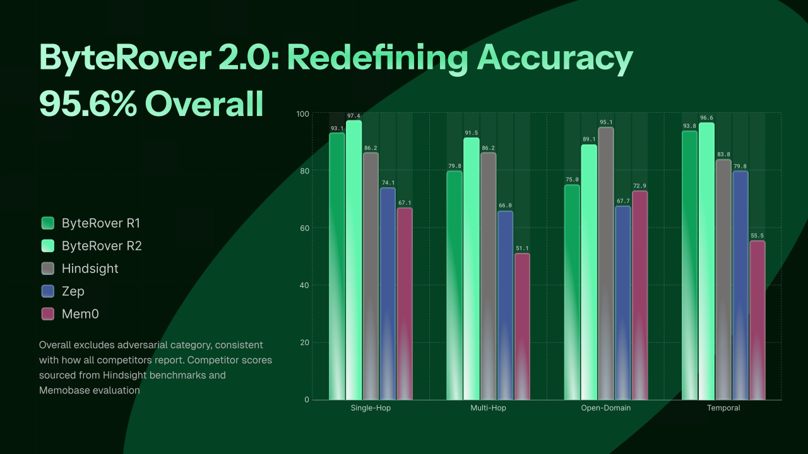

# brv-bench

Benchmark suite for evaluating retrieval quality, latency, and diversity of AI agent context systems. Built for [ByteRover](https://www.byterover.dev/).


## Setup

```bash
source scripts/source_env.sh
python -m brv_bench --help
```

## Supported Datasets

| Dataset | Description | Corpus | Queries | Download | Context Tree |
|---------|-------------|--------|---------|----------|:------------:|
| LoCoMo | Long-term conversation memory QA (10 conversations, 272 sessions) | 272 docs | 1982 | [locomo10.json](https://github.com/snap-research/locomo/blob/main/data/locomo10.json) | [download](https://drive.google.com/file/d/1YxlrXgPOcXeEmR2C3I0Px53L_WuVBbBW/view) |
| LongMemEval | Long-term interactive memory benchmark (ICLR 2025, 6 memory abilities) | 948 docs (oracle) | 500 | [HuggingFace](https://huggingface.co/datasets/xiaowu0162/longmemeval-cleaned) | |

## Usage

### 1. Transform dataset

Pre-transformed datasets are provided in `assets/` (`locomo.json`, `longmemeval_s.json`) — you can skip this step and pass those files directly to `curate`/`evaluate`.

To transform from raw sources:

```bash
# LoCoMo
python scripts/transform_locomo.py locomo10.json output/locomo_benchmark.json

# LongMemEval (three variants: oracle / s_cleaned ~40 sessions / m_cleaned ~500 sessions)
python scripts/transform_longmemeval.py longmemeval_oracle.json output/longmemeval_benchmark.json
```

### 2. Curate (populate context tree)

```bash
python -m brv_bench curate --ground-truth assets/locomo.json
```

### 3. Evaluate

```bash
python -m brv_bench evaluate --ground-truth output/locomo_benchmark.json
```

Results are saved to `report/{yyyymmdd}_{dataset}_{memory_system}.json/.txt`. Per-query results are written incrementally (crash-safe).

#### LLM-as-Judge

Install deps and set an API key, then pass `--judge`:

```bash
pip install 'brv-bench[judge]'
export GEMINI_API_KEY="your-api-key"   # or ANTHROPIC_API_KEY / OPENAI_API_KEY

python -m brv_bench evaluate \
  --ground-truth output/locomo_benchmark.json \
  --judge --judge-cache report/judge_cache.json
```

| Flag | Default | Description |
|------|---------|-------------|
| `--judge` | off | Enable LLM-as-Judge metric |
| `--judge-backend` | `gemini` | `gemini`, `anthropic`, or `openai` |
| `--judge-model` | `gemini-2.5-flash` / `claude-sonnet-4-6` / `gpt-4o-2024-08-06` | Model name override (default varies by backend) |
| `--judge-concurrency` | `5` | Max parallel judge API calls |
| `--judge-cache` | none | Path to JSON cache file |

#### Isolated Mode

Scopes the context tree to one question at a time to prevent cross-question contamination. Requires a pre-curated source directory.

```bash
python -m brv_bench evaluate \
  --ground-truth output/longmemeval_benchmark.json \
  --context-tree-source path/to/full-context-tree \
  --judge --judge-cache report/judge_cache.json
```

Source layout: `{context-tree-source}/{question_id}/{session_id}/key_facts.md`

#### Justifier

Automatically enabled for datasets with a `justifier_template` (LoCoMo and LongMemEval). Uses the same API key as the judge.

| Flag | Default | Description |
|------|---------|-------------|
| `--justifier-backend` | `gemini` | `gemini`, `anthropic`, or `openai` |
| `--justifier-model` | `gemini-2.5-flash` / `claude-sonnet-4-6` / `gpt-4o-2024-08-06` | Model name override (default varies by backend) |

#### Ground Truth Format

```json
{
  "name": "locomo",
  "corpus": [{ "doc_id": "session_1", "content": "...", "source": "conv-26" }],
  "entries": [{
    "query": "What career path has Caroline decided to pursue?",
    "expected_doc_ids": ["session_1", "session_4"],
    "expected_answer": "counseling or mental health for transgender people",
    "category": "multi-hop"
  }]
}
```

## Metrics

| Metric | What It Measures |
|--------|-----------------|
| LLM Judge | LLM-as-Judge binary correctness (requires `--judge`) |
| Precision@K | Fraction of top-K results that are relevant |
| Recall@K | Fraction of relevant documents found in top-K |
| NDCG@K | Ranking quality of top-K |
| MRR | Reciprocal rank of the first relevant result |
| Cold Latency | Query time with no cache (p50/p95/p99) |


## Results on LoCoMo (LLM Judge Accuracy %)



| Method | Single-Hop | Multi-Hop | Open Domain | Temporal | Overall |
|--------|:----------:|:---------:|:-----------:|:--------:|:-------:|
| **ByteRover R2** | **97.38** | **91.49** | **89.13** | **96.57** | **95.64** |
| **ByteRover R1** | **93.10** | **79.79** | **75.00** | **93.77** | **89.71** |
| Hindsight (Gemini-3) | 86.17 | 70.83 | 95.12 | 83.80 | 89.61 |
| Hindsight (OSS-120B) | 76.79 | 62.50 | 93.68 | 79.44 | 85.67 |
| Hindsight (OSS-20B) | 74.11 | 64.58 | 90.96 | 76.32 | 83.18 |
| Zep | 74.11 | 66.04 | 67.71 | 79.79 | 75.14 |
| Mem0-Graph | 65.71 | 47.19 | 75.71 | 58.13 | 68.44 |
| Mem0 | 67.13 | 51.15 | 72.93 | 55.51 | 66.88 |

## Reproduction

To reproduce the ByteRover results above:

```bash
# For LoCoMo
python -m brv_bench evaluate \
  --ground-truth output/locomo.json \
  --judge \
  --judge-model "gemini-2.5-flash" \
  --justifier-model "gemini-3-pro-preview"
```

## Requirements
- byterover-cli >= 2.0.0
- Python >= 3.12
- A project with `brv` initialized (`.brv/` directory exists)
