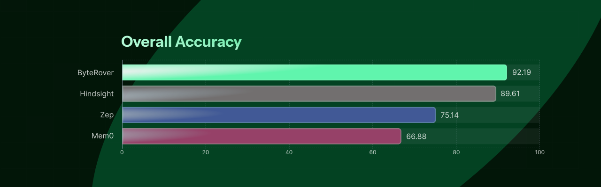
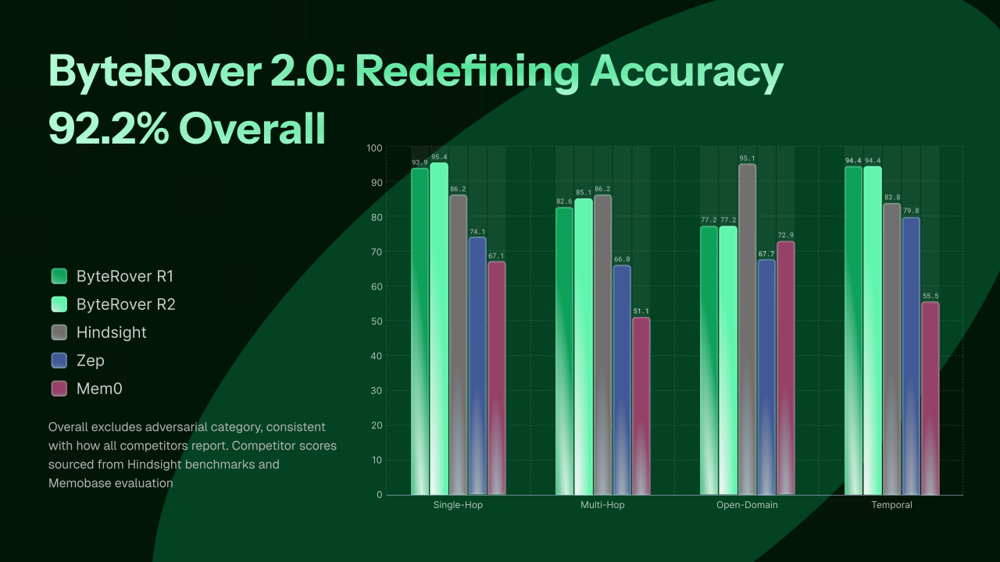

<p align="center"></p>

Benchmark suite for evaluating retrieval quality, latency, and diversity of AI agent context systems. Powered for ByteRover, engineered by [ByteRover](https://www.byterover.dev/).

## Blog Posts

- Benchmarking Breakdown: [Benchmarking AI agent memory: ByteRover 2.0 Scores 92.2% and Rewrites the LoCoMo Leaderboard](https://www.byterover.dev/blog/benchmark-ai-agent-memory)
- Architecture Analysis: [Architecture Deep Dive: ByteRover CLI 2.0 - Memory For Autonomous Agents](https://www.byterover.dev/blog/memory-architecture)

## Overall Accuracy

## Setup

```bash
source scripts/source_env.sh
python -m brv_bench --help
```

## Supported Datasets

| Dataset | Description | Corpus | Queries | Download | Context Tree |
|---------|-------------|--------|---------|----------|:------------:|
| LoCoMo | Long-term conversation memory QA (10 conversations, 272 sessions) | 272 docs | 1982 | [locomo10.json](https://github.com/snap-research/locomo/blob/main/data/locomo10.json) | [download](https://drive.google.com/file/d/1-TZztm2_hHRSeh0U_UjopxxiqHg4OBOH/view?usp=drive_link) |
| LongMemEval-S | Long-term interactive memory benchmark (ICLR 2025, 6 memory abilities, ~48 sessions/question) | 23,867 docs | 500 | [HuggingFace](https://huggingface.co/datasets/xiaowu0162/longmemeval-cleaned) | [download](https://drive.google.com/file/d/1TwZfbrCvQRsWiRfky6d2WExgntIFC9pH/view?usp=drive_link) |

## Usage

### 1. Transform dataset

Pre-transformed datasets are provided in `assets/` (`locomo_sample.json`, `longmemeval_s.json`) — you can skip this step and pass those files directly to `curate`/`evaluate`.

To transform from raw sources:

```bash
# LoCoMo → produces assets/sample_data/locomo.json (already provided)
python scripts/transform_locomo.py locomo10.json assets/sample_data/locomo.json

# LongMemEval (three variants: oracle / s_cleaned ~40 sessions / m_cleaned ~500 sessions)
# → produces assets/longmemeval_s.json (already provided)
python scripts/transform_longmemeval.py longmemeval_oracle.json assets/longmemeval_s.json
```

### 2. Curate (populate context tree)

```bash
python -m brv_bench curate --ground-truth assets/sample_data/locomo.json
```

### 3. Evaluate

```bash
export GEMINI_API_KEY="your-api-key"

python -m brv_bench evaluate \
  --ground-truth assets/sample_data/locomo.json \
  --judge \
  --judge-cache report/judge_cache_locomo_gemini.json
```

The justifier is automatically enabled for LoCoMo and LongMemEval (no extra flag needed). See [LLM-as-Judge](#llm-as-judge) and [Justifier](#justifier) below for detailed configuration options.

Results are saved to `report/{yyyymmdd}_{dataset}_{memory_system}.json/.txt`. Per-query results are written incrementally (crash-safe).

#### LLM-as-Judge

Install deps and set an API key, then pass `--judge`:

```bash
pip install 'brv-bench[judge]'
export GEMINI_API_KEY="your-api-key"   # or ANTHROPIC_API_KEY / OPENAI_API_KEY

python -m brv_bench evaluate \
  --ground-truth assets/sample_data/locomo.json \
  --judge --judge-cache report/judge_cache_locomo_gemini.json
```

| Flag | Default | Description |
|------|---------|-------------|
| `--judge` | off | Enable LLM-as-Judge metric |
| `--judge-backend` | `gemini` | `gemini`, `anthropic`, or `openai` |
| `--judge-model` | `gemini-2.5-flash` / `claude-sonnet-4-6` / `gpt-4o-2024-08-06` | Model name override (default varies by backend) |
| `--judge-concurrency` | `5` | Max parallel judge API calls |
| `--judge-cache` | none | Path to JSON cache file |
| `--context-tree-source` | none | Path to pre-curated context tree for isolated mode |

#### Isolated Mode

Scopes the context tree to one question at a time to prevent cross-question contamination. Requires a pre-curated source directory.

```bash
python -m brv_bench evaluate \
  --ground-truth assets/longmemeval_s.json \
  --context-tree-source path/to/full-context-tree \
  --judge --judge-cache report/judge_cache_longmemeval_gemini.json
```

Source layout: `{context-tree-source}/{question_id}/{session_id}/key_facts.md`

#### Justifier

Automatically enabled for datasets with a `justifier_template` (LoCoMo and LongMemEval). Uses the same API key as the judge.

| Flag | Default | Description |
|------|---------|-------------|
| `--justifier-backend` | `gemini` | `gemini`, `anthropic`, or `openai` |
| `--justifier-model` | `gemini-2.5-flash` / `claude-sonnet-4-6` / `gpt-4o-2024-08-06` | Model name override (default varies by backend) |

#### Ground Truth Format

```json
{
  "name": "locomo",
  "corpus": [{ "doc_id": "session_1", "content": "...", "source": "conv-26" }],
  "entries": [{
    "query": "What career path has Caroline decided to pursue?",
    "expected_doc_ids": ["session_1", "session_4"],
    "expected_answer": "counseling or mental health for transgender people",
    "category": "multi-hop"
  }]
}
```

## Metrics

| Metric | What It Measures |
|--------|-----------------|
| LLM Judge | LLM-as-Judge binary correctness (requires `--judge`) |
| Precision@K | Fraction of top-K results that are relevant |
| Recall@K | Fraction of relevant documents found in top-K |
| NDCG@K | Ranking quality of top-K |
| MRR | Reciprocal rank of the first relevant result |
| Cold Latency | Query time with no cache (p50/p95/p99) |


## Results (LLM Judge Accuracy %)

### LongMemEval-S

<!--  -->

| Category | Queries | ByteRover 2.1.5 Run 1 (Gemini 3 Flash) | ByteRover 2.1.5 Run 2 (Gemini 3.1 Pro) | Hindsight (Gemini 3 Pro) | HonCho |
|----------|:-------:|:--------------------------------------:|:---------------------------------:|:------------------------:|:------:|
| Knowledge Update | 78 | **98.7% (77/78)** | 94.9% (74/78) | 94.9% | 94.9% |
| Single-Session User | 70 | 98.6% (69/70) | **100% (70/70)** | 97.1% | 94.3% |
| Single-Session Assistant | 56 | **98.2% (55/56)** | 94.6% (53/56) | 96.4% | 96.4% |
| Single-Session Preference | 30 | **96.7% (29/30)** | 86.7% (26/30) | 80.0% | 90.0% |
| Temporal Reasoning | 133 | 91.7% (122/133) | **94.0% (125/133)** | 91.0% | 88.7% |
| Multi-Session | 133 | 84.2% (112/133) | 85.0% (113/133) | **87.2%** | 85% |
| **Overall** | **500** | **92.8% (464/500)** | **92.2% (461/500)** | **91.4%** | **90.4%** |

### LoCoMo



| Category | ByteRover 2.1.5 | ByteRover 2.0 (Run 2) | Hindsight | HonCho | Memobase v0.0.37 | Zep | Mem0 | OpenAI Memory |
|----------|:---------------:|:---------------------:|:---------:|:------:|:----------------:|:---:|:----:|:-------------:|
| Single-Hop | **97.5% (820/841)** | 95.4% | 86.2% | 93.2% | 70.9% | 74.1% | 67.1% | 63.8% |
| Multi-Hop | **93.3% (263/282)** | 85.1% | 70.8% | 84.0% | 46.9% | 66.0% | 51.2% | 42.9% |
| Open Domain | 85.9% (79/92) | 77.2% | **95.1%** | 77.1% | 77.2% | 67.7% | 72.9% | 62.3% |
| Temporal | **97.8% (314/321)** | 94.4% | 83.8% | 88.2% | 85.1% | 79.8% | 55.5% | 21.7% |
| **Overall** | **96.1%** | 92.2% | 89.6% | 89.9% | 75.8% | 75.1% | 66.9% | 52.9% |

## Reproduction

To reproduce our best runs, we highly recommend using the pre-curated context trees from [Supported Datasets](#supported-datasets) for consistent performance.

- **LoCoMo:** Place the curated context tree inside `.brv/context-tree/`.
- **LongMemEval-S:** Place the curated context tree **outside** `.brv/context-tree/` and pass it via `--context-tree-source` (isolated mode).

```bash
# For LongMemEval-S (ByteRover 2.1.5 Run 1)
python -m brv_bench evaluate \
  --ground-truth output/longmemeval_s_benchmark.json \
  --judge \
  --judge-model "gemini-3-flash" \
  --justifier-model "gemini-3.1-pro-preview" \
  --context-tree-source LME-S-context-tree \
  --limit 32

# For LoCoMo (ByteRover 2.1.5)
python -m brv_bench evaluate \
  --ground-truth output/locomo.json \
  --judge \
  --judge-model "gemini-3-flash-preview" \
  --justifier-model "gemini-3.1-pro-preview"
```

## Requirements
- byterover-cli >= 2.1.5
- Python >= 3.12
- A project with `brv` initialized (`.brv/` directory exists)
